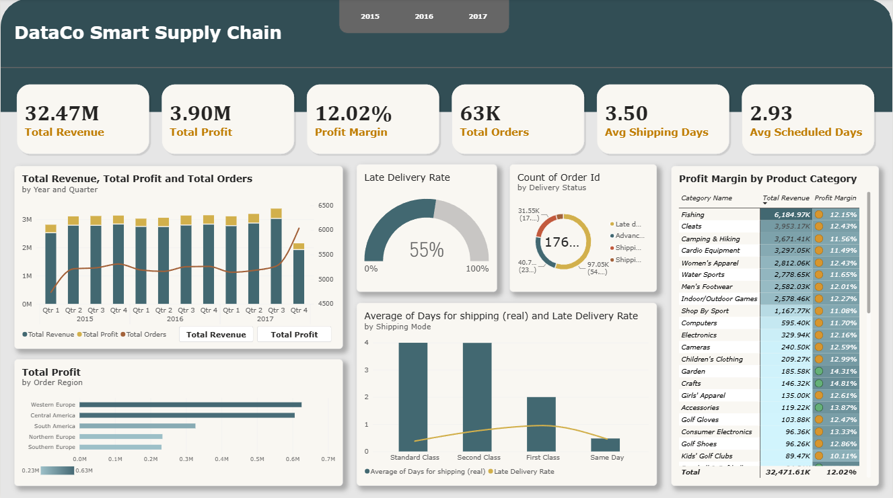
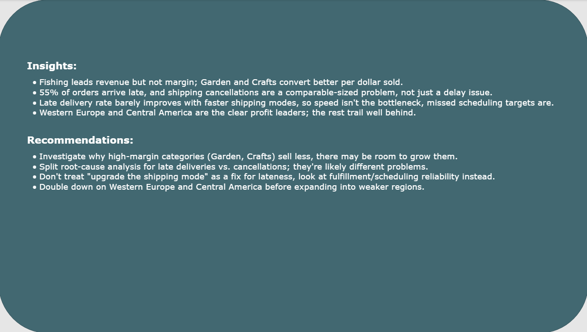

# DataCo Supply Chain — Profitability Analysis

A Power BI analysis of DataCo Global's supply chain data, built to answer one question: which markets, product categories, and shipping modes actually drive profit — not just revenue.

## Scope

This dataset supports several possible angles: late-delivery prediction, fraud/order-status analysis, customer segmentation. I deliberately steered away from delivery-risk prediction here, since that's already the subject of a separate ML project ([olist-marketplace-analysis](https://github.com/doniyor117/olist-marketplace-analysis)). The goal for this project was different: build a BI dashboard that a business stakeholder could actually use to decide where to invest — by region, category, and shipping strategy — using Power Query and DAX rather than a predictive model.

## Data

[DataCo Smart Supply Chain dataset](https://www.kaggle.com/datasets/shashwatwork/dataco-smart-supply-chain-for-big-data-analysis) — ~180,000 order-line records across 5 markets and 24 order regions, 2015–2018.

The dataset is real (not synthetic), and arrived largely clean. The only two fields with meaningful nulls were `Product Description` and `Order Zipcode`, both dropped as they weren't relevant to this analysis. PII fields (customer email, password, first/last name) and non-analytical fields (product image URL) were also removed.

**Scope note:** the dataset's final quarter (Q1 2018) is a partial period — data collection ends mid-quarter, not at quarter-end. Left in, it renders as a steep artificial drop in every time-based chart, which reads as a business collapse that isn't real. The analysis is scoped to **2015–2017 (12 complete quarters)**; 2018 is excluded entirely rather than shown as a misleading partial bar.

**Canonical revenue field:** the dataset carries two overlapping value columns — `Sales` (pre-discount list price) and `Order Item Total` (actual amount charged after discount). They diverge meaningfully (mean difference ~$20 per line, verified with a pandas check across the full dataset). `Order Item Total` is used as the canonical revenue figure throughout, since it reflects money actually collected, not list price.

## Tools

Power BI Desktop — Power Query (M) for cleaning and shaping, DAX for measures, native visuals for the report. No external cleaning pipeline; all transformation happens inside the Power Query model.

## Dashboard



The report has two pages: a metrics/visuals page (above) and a written insights & recommendations page (below), rather than folding narrative text into the chart page itself.

**Page 1** — KPI row (Total Revenue, Total Profit, Profit Margin, Total Orders, Avg Shipping Days, Avg Scheduled Days), a quarterly revenue/profit/order-count trend, profit by region, profit margin by product category, a late-delivery/delivery-status breakdown, and average shipping days vs. late-delivery rate by shipping mode.

## Key Findings

- **Revenue and margin don't move together.** Fishing is the top revenue category (~$6.2M) but sits at a mid-tier 12.15% margin. Garden (14.31%) and Crafts (14.81%) carry far less revenue but convert better per dollar sold — a case for growing an underweighted category rather than just optimizing the biggest one.
- **55% of all orders arrive late**, and shipping cancellations are a comparably sized slice of the delivery-status breakdown — not a rounding error next to lateness, a distinct problem.
- **Late-delivery rate doesn't track shipping-mode speed.** Average shipping time scales down cleanly by mode (~4 days for Standard/Second Class to under 1 day for Same Day), exactly as expected — but the late-delivery rate stays in a similar band across all four modes. This suggests lateness is measured against each mode's own promised window, not absolute delivery speed, so a faster mode isn't automatically a more reliable one.
- **Profit concentrates in two markets.** Western Europe and Central America lead by a wide margin; the remaining regions form a long, thin tail rather than a gradual decline.
- **Q4 2017 (the last complete quarter) shows a genuine revenue slowdown** — distinct from the 2018 data-cutoff artifact, and worth flagging as a real pattern rather than a data issue, though one quarter isn't enough to call it a trend on its own.

## Recommendations



- Investigate why high-margin categories (Garden, Crafts) sell less — there may be room to grow them through pricing, marketing, or inventory changes.
- Treat late deliveries and cancellations as separate root causes needing separate fixes, not one shared explanation.
- Don't recommend "upgrade the shipping mode" as a fix for lateness — investigate fulfillment/scheduling reliability instead, since speed alone doesn't explain the late-delivery rate.
- Protect and grow Western Europe and Central America before expanding into weaker regions; confirm whether those regions' lower profit reflects a real demand ceiling or a fixable execution gap.

---

## Repo Structure

```text
├── screenshots/
│ ├── dashboard.png
│ └── insights-recommendations.png
├── dataco-supply-chain-analysis.pbix
└── README.md
```

---


## Notes

Power Query M syntax was assisted by Claude during development; cleaning decisions, measure definitions, and business framing are mine.
